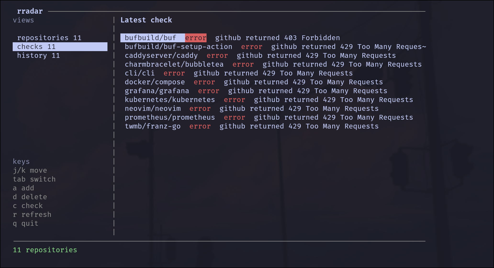

# release-radar

Minimal GitHub release tracker.



## Installation

Install from the repository root:

```sh
go install ./cmd/rradar
```

The binary will be installed to `~/go/bin/rradar`. Make sure `~/go/bin` is in
your `PATH`:

```sh
echo 'export PATH="$HOME/go/bin:$PATH"' >> ~/.zshrc
source ~/.zshrc
```

You can also build a local binary:

```sh
go build -o rradar ./cmd/rradar
./rradar
```

## GitHub token

For comfortable day-to-day use, set a GitHub token in the `GITHUB_TOKEN`
environment variable. It gives the app a higher GitHub API rate limit and helps
avoid `403 Forbidden` / `429 Too Many Requests` responses while checking many
repositories.

```sh
export GITHUB_TOKEN=ghp_your_token_here
```

To keep it available in new terminal sessions:

```sh
echo 'export GITHUB_TOKEN=ghp_your_token_here' >> ~/.zshrc
source ~/.zshrc
```

## CLI

```sh
rradar add owner/repo
rradar list
rradar check
rradar history
rradar delete owner/repo
```

## TUI

Run without arguments:

```sh
rradar
```

Keys:

- `j` / `k` or arrows: move selection
- `tab` / left / right: switch views
- `a`: add repository
- `d`: delete selected repository
- `c`: check releases
- `r`: refresh current view
- `q`: quit
